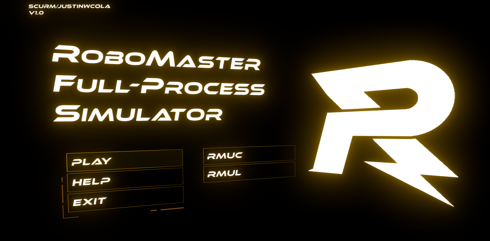
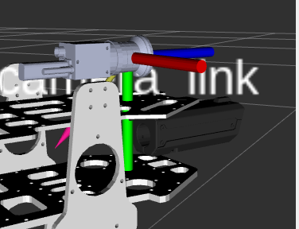

# 2025赛季四川大学火锅战队视觉导航组第二轮考核

**本次第二轮考核题目汇总如下，请大家务必仔细阅读。**

<font color = #dd0000>**考核截止时间为9月5号24点前，所有题目的回答需全部按要求汇总上传至个人GitHub或者Gitee，提交时需告知仓库链接并公开访问。**</font>

*Tips：大小超过100M的文件需额外安装Git LFS进行上传。*


## 1. ROS and TF2

大家已经在线上培训中学习了ROS2和TF2的基础知识，这次项目实验将让大家灵活运用所学知识，按照要求编写程序。

### 实验环境

#### 1. RMSimulator仿真器环境

实验将以RMSimulator仿真器作为测试环境；

**启动方法**：进入RMSimulator文件夹，双击RMSimulator.x86_64文件，点击PLAY，选择`RMUL`，即成功启动实验测试环境；

**使用技巧**：Ubuntu环境下可能无法在仿真环境中切出鼠标，按下Alt+Tab键即可切换软件界面并切出鼠标；wasd控制自己的机器人移动，鼠标晃动可移动视角；

#### 2. URDF模型文件

这是一个ROS package，需要大家自行Build，Build完成后使用自带的Python脚本启动即可，启动后可在rivz2中查看机器人云台模型

### 实验内容

#### 1. rqt和命令行工具

同时启动RMSimulator仿真器和URDF模型包，打开rqt观察节点图，并使用ros2自带的命令行工具查看各话题消息内容，对节点图和消息内容进行简要的文字叙述；

#### 2. 编写一个订阅者发布者节点

接收仿真器发布的图像数据，在订阅者中计算图像的帧率(fps)，将帧率显示到图像上并发布；

**提示：**

需要引用的图像传输和处理相关的头文件：

```cpp
#include <image_transport/image_transport.hpp>
#include <image_transport/publisher.hpp>
#include <image_transport/subscriber_filter.hpp>
#include <sensor_msgs/msg/image.hpp>

#include <opencv2/core.hpp>
#include <opencv2/core/types.hpp>
```

package.xml文件中需要引用的库

```xml
<depend>cv_bridge</depend>
<depend>image_transport</depend>
<depend>image_transport_plugins</depend>
<depend>vision_opencv</depend>
<depend>sensor_msgs</depend>
```

自行查阅cmake文件的写法；

图像发布者的创建方法：

```cpp
this->create_subscription<sensor_msgs::msg::Image>(
    "/* 此处填写话题名称 */", rclcpp::SensorDataQoS(),
    std::bind(&ArmorDetectorNode::imageCallback, this, std::placeholders::_1));
```

订阅者回调函数函数参数表写法：

```cpp
void imageCallback(const sensor_msgs::msg::Image::ConstSharedPtr img_msg)
```

将接收的数据转换成opencv格式：

```cpp
auto img = cv_bridge::toCvShare(img_msg, "rgb8")->image;
```

[参考示例](https://github.com/robomaster-oss/rmoss_core/blob/humble/rmoss_cam/src/cam_client.cpp)

#### 3. 感知敌人坐标

RMSimulator仿真器在不断发布敌人坐标信息，你需要编写一个订阅者节点接收这些坐标信息，并存储在一个队列中，要求：

1. 队列长度为10；
2. 队列刷新频率为1s，即每隔一秒将刚接收到的坐标数据添加进队列，并将最老的数据从队列中删去；

**提示：**

自行通过ROS2内置的调试工具查看坐标数据的数据类型，选择合适的消息接口；

自行学习C++队列数据类型的使用方法，使用该数据类型实现队列存储；

#### 4. 坐标变换

已知RMSimulator中发布的坐标点所在的坐标系如下，这是一个左手坐标系，坐标原点位于相机光心处：


URDF模型的相机光心坐标系如下，这是一个右手坐标系：


要求：

第一步：保持坐标坐标原点不变，将接收到的点的坐标转换为URDF相机光心坐标系下的坐标

第二步：使用tf2库，将URDF模型中相机光心坐标系下的坐标转换到base_link坐标系下，并将转换后的点存储到队列中

#### 5. 三维可视化

将队列中点的数据**实时**发布为rviz2箭头类型的marker，箭头的起点为前一个点，终点为后一个点；

### 提交要求

若正确完成了所有实验步骤，就可以在rivz2中看到仿真器中敌人的运动轨迹，这一轨迹和仿真器中的真实运动轨迹大致相同（可能会有些许误差，这是因为实验提供的URDF模型不太准确）；

需要提交的内容：

1. 所有源代码和Build好的功能包
2. 实验内容部分的录屏


## 2. 模型部署应用

<font size = "4">**为了方便，本题目要求基于OnnxRuntime模型加速推理框架实现。**</font>

*Tips：若个人设备有带核显的英特尔CPU，更推荐大家使用OpenVINO进行开发。*

本题目将提供基于YOLOv8-Pose改进的神经网络模型，开发语言任选。

参考代码：

[YOLOv8-OpenVINO-C++](https://github.com/openvino-book/yolov8_openvino_cpp)

[YOLOv8-OpenVINO-Python](https://github.com/openvino-book/yolov8_openvino)

[YOLOv8-OnnxRuntime-C++](https://github.com/UNeedCryDear/yolov8-opencv-onnxruntime-cpp)

YOLOv8-OnnxRuntime-Python 可找陈盛烽寻找参考，主要是没找到合适的参考开源给大家。


#### 1. 模型可视化

使用Netron进行模型可视化，确定模型输入层和输出层参数。尤其注意输出层数据的排序，yolov8-pose为x、y、w、h + N个分类的置信度 + M个关键点坐标。


#### 2. 模型部署

编写程序，使用OnnxRuntime（或OpenVINO）部署附件中的best.onnx模型文件，对附件中的能量机关视频（test_video.mp4）进行检测，并使用PnP输出其相对于相机坐标系的位置与姿态信息（旋转向量和平移向量）。

给定相机内参如下：

```yaml
image_width: 1280
image_height: 1024
camera_name: narrow_stereo
camera_matrix:
  rows: 3
  cols: 3
  data: [2075.15666,    0.     ,  646.02307,
            0.     , 2073.92438,  479.8963 ,
            0.     ,    0.     ,    1.     ]
distortion_model: plumb_bob
distortion_coefficients:
  rows: 1
  cols: 5
  data: [-0.051148, 0.231678, 0.000775, 0.002697, 0.000000]
rectification_matrix:
  rows: 3
  cols: 3
  data: [1., 0., 0.,
         0., 1., 0.,
         0., 0., 1.]
projection_matrix:
  rows: 3
  cols: 4
  data: [2069.80322,    0.     ,  647.4636 ,    0.     ,
            0.     , 2070.58691,  479.94672,    0.     ,
            0.     ,    0.     ,    1.     ,    0.     ]
```

给定能量机关参考点如下：

```c++
buff_3d_points = {
  {0, 0.1700, 0.1750}, 
  {0, -0.1700, 0.1750},
  {0, -0.1850, -0.1650},
  {0, 0, -0.7150},
  {0, 0.1850, -0.1650}};
```

**注意：提供的模型文件为输出四个特征点的模型，包含六个分类，分别为红色和蓝色灯光下的中心R标、未被击打图案的扇叶、已被击打图案的扇叶，而给定的参考点为五个特征点，上述参考点依次为能量机关扇叶击打区域的左上角、右上角、右下角、中心R标和扇叶击打区域左下角。**

**注意对模型输出结果做NMS非极大值抑制处理。**

#### 提交要求

- 所有源代码
- 检测结果输出视频。


## 3. Navigation (Optional)

<font size="5">**仿真中机器人追击敌人的实现**</font>

建议在培训时分发的Docker镜像的基础上完成，进入镜像后先拉取最新代码并且编译。

- 仿真场景：RMUL

- 需要完成的子任务：

  1. 建图：在仿真环境中使用fast-lio2建点云图，同时生成栅格地图，保存为png格式。
  2. 编写ROS2节点(c++或python)：发布敌人在地图中的位置。编写一个ROS2节点，周期性查询enemy相对于yaw_link的tf关系，将transform填入auto_aim_interfaces/msg/target的position中，tracking设置为true,加上时间戳，其他字段随意填写。周期性发布到`/tracker/target'话题中。
  3. 编写行为树xml：实现机器人追击敌人的行为树。

- 思路提示：完成建图工作后，再次启动系统

  ```bash
  ros2 launch pb_rm_simulation rm_simulation.launch.py
  ```

  ```bash
  ros2 launch sentry_bringup bringup_all_in_one.launch.py
  ```

  发布敌人在地图中的位置

  ```bash
  ros2 run tf2_ros static_transform_publisher x y 0 0 0 0 map enemy
  ```

  启动模拟裁判系统

  ```bash
  ros2 run control_panel control_panel
  ```

  启动决策节点

  ```bash
  ros2 launch sentry_navigation2 navigation2.launch.py
  ```

  运行要求编写的节点

  ```bash
  ros2 run xxxxx
  # or
  python3 xxxxx.py
  ```

  #### 提交要求

  1. 提交建出的栅格地图的图片文件；
  2. 以及编写的ROS2节点的代码文件；
  3. 行为树的xml文件；
  4. 完整运行的录屏；
  5. 如果有其他觉得有必要的文件也可以提交。
